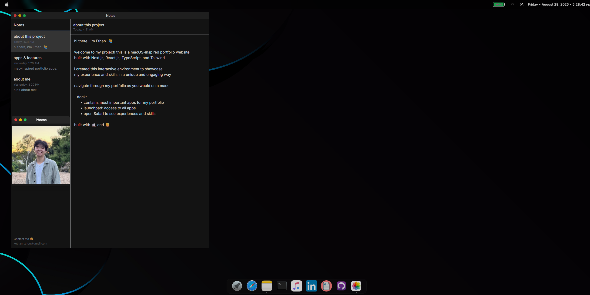

# macOS Portfolio 



welcome to my project! this is a macOS-inspired portfolio website 
built with Next.js, React.js, TypeScript, and Tailwind

Project Link: [https://ethannhzhouu.vercel.app/](https://ethannhzhouu.vercel.app/)

i created this interactive environment to showcase 
my experience and skills in a unique and engaging way

## Apps and Features

𝗨𝘀𝗲𝗿 𝗜𝗻𝘁𝗲𝗿𝗳𝗮𝗰𝗲
- dock: 
- contains most important apps for my portfolio
- launchpad: access to all apps
- open Safari to see experiences and skills

- menu bar (top left to top right): 
      • last updated date
      • sleep / restart / shutdown / logout
      • name of currently focused app
      • battery display
      • spotlight search
      • control center
      • time display

- spotlight (top right): 
      • access to all apps

- control center (top right): 
      • toggle light and dark theme
      • brightness slider
      • wi-fi button (disabling wi-fi will disconnect safari)
      • bluetooth button (for aesthetic, no functionality)
      • enter fullscreen

𝗣𝗿𝗼𝗱𝘂𝗰𝘁𝗶𝘃𝗶𝘁𝘆 & 𝗦𝗼𝗰𝗶𝗮𝗹
• launchpad: customizable app launcher inspired by macOS

• safari: opens a website about my experiences and skills

• mail: opens gmail in a new tab

• notes: note-taking for project details

• terminal: interactive commands with my portfolio

• github: direct access to project source code

• linkedin: professional profile with experience

• resume: opens my resume with a downloadable PDF


𝗠𝗲𝗱𝗶𝗮 & 𝗘𝗻𝘁𝗲𝗿𝘁𝗮𝗶𝗻𝗺𝗲𝗻𝘁
• music: music player featuring 3 songs I'm listening to right now

• photos: 3 picture click slideshow of me

• youtube: links to youtube where you can watch videos

• weather: app with animated particles and mock weather data

• blackjack: try to reach as close to 21 versus the dealer

• loldodge: links to loldodgegame, dodge and attack enemies


##### Prerequisites

- Node.js 16.x or higher
- npm or yarn

##### Installation

1. Clone the repository:

```bash
git clone https://github.com/ethannhzhouu/ethan-portfolio.git
cd ethan-portfolio

2. Install 
npm install

3. Run the development server:
npm run dev
```
4. Open [http://localhost:3000](http://localhost:3000).

## Inspiration
I drew inspiration from a portfolio I saw on [TikTok](https://www.tiktok.com/t/ZP8BkgYnk/) 

Researched existing open source macOS portfolios:  
- [playground-macos](https://github.com/Renovamen/playground-macos)
- [danielprior-macos](https://github.com/daprior/danielprior-macos/)

Deployed with Vercel

## 📧 Contact

Ethan Zhou - [mail@xethanhzhou@gmail.com](mailto:mail@xethanhzhou@gmail.com)

